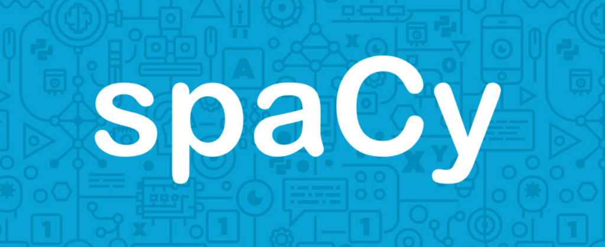

# **Kim Sagha**

Hi there, and welcome to my GitHub profile! 👋

My name is Kim and I'm a 22 year old girl from Sweden 🇸🇪 I started my tech-journey in 2017 at Schneider Electric, in the incredible world of IoT and energy, building smart and efficient building management systems 🌳 In 2018, I made the awesome life-changing decision of moving to the UK to study Computer Science with Artificial Intelligence, where I learnt how to program and build AI models 📘 Since graduating, I've spent a majority of my time researching new technologies in data science, predominantly focusing on fields within ML such as supervised models, NLP and deep learning, and implementing these new skills in projects as demonstrated here on GitHub 🧠 Feel free to check them out, fork them and add new features, or contact me to discuss them further! 👍

### Goals for 2021
- [x] Complete my undergraduate degree!
- [x] [Learn about NLP and complete at least 1 project](https://github.com/kimsagha/NLP_Sentiment_Analysis)
- [x] [Learn how to host a database on Docker and interact with it using PostgreSQL](https://github.com/kimsagha/DB_Transaction_analysis)
- [ ] Increase GitHub contributions
- [ ] Build a deep neural network using PyTorch
- [ ] Learn how to use either of the following two cloud technologies: AWS, GCP
- [ ] Implement a project where I use an API to extract data

### GitHub Stats

### Top Languages

### Tech Stack
#### Languages

#### Technologies

#### Python Libraries

### Things I Like to Do When I’m Not Coding

### How to Reach Me

